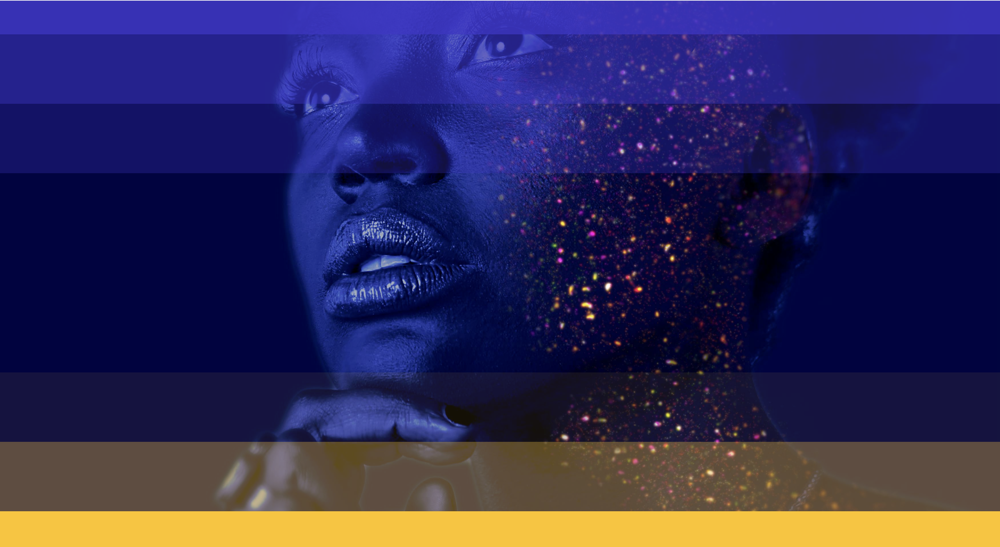

# Gsap Scroll Animation

 

This is a simple project that demonstrates the use of GSAP library to create a scroll animation. The animation is triggered when the user scrolls down the page. The project is built using HTML, CSS, JavaScript and GSAP.

## Features
- Section Scrolling Effect
- Smooth Scrolling Animation
- GSAP Animations
- Easy to Use

## Usage

To use this, simply open the `index.html` file in your web browser.

## Author

- [Farid Vatani - Software Engineer](https://github.com/faridvatani)

## Contributing

Contributions are welcome. Please feel free to fork this repository and open a pull request to add more features, fix bugs, improve documentation etc.

## Acknowledgements

This project was inspired by the "Awwwards Element" from [Nord Quantique](https://nordquantique.ca/fr).

## License

This project is licensed under the MIT License. See the [LICENSE](LICENSE) file for more details.
